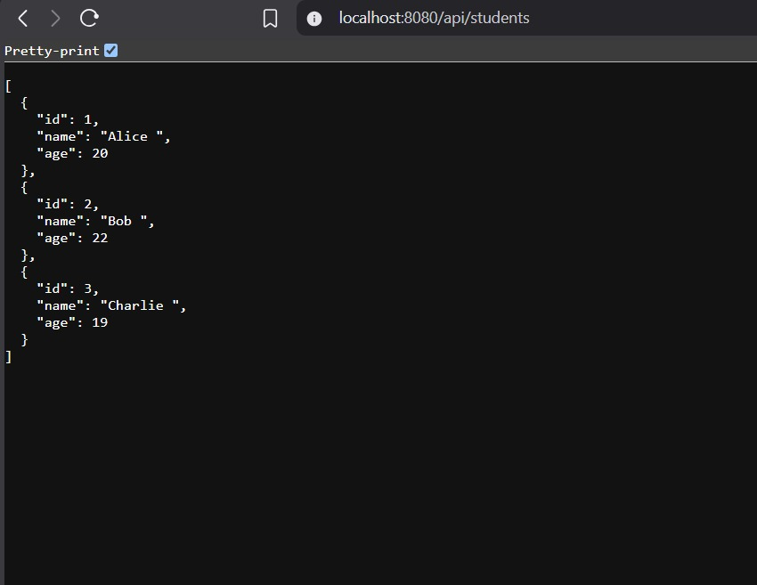
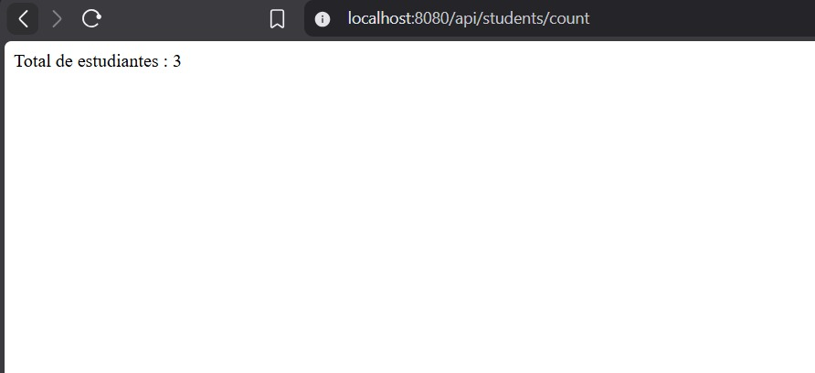
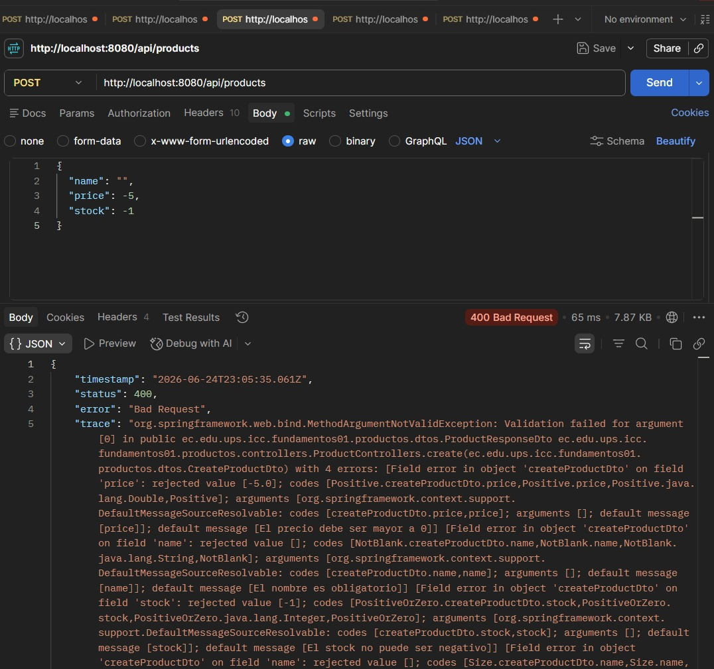
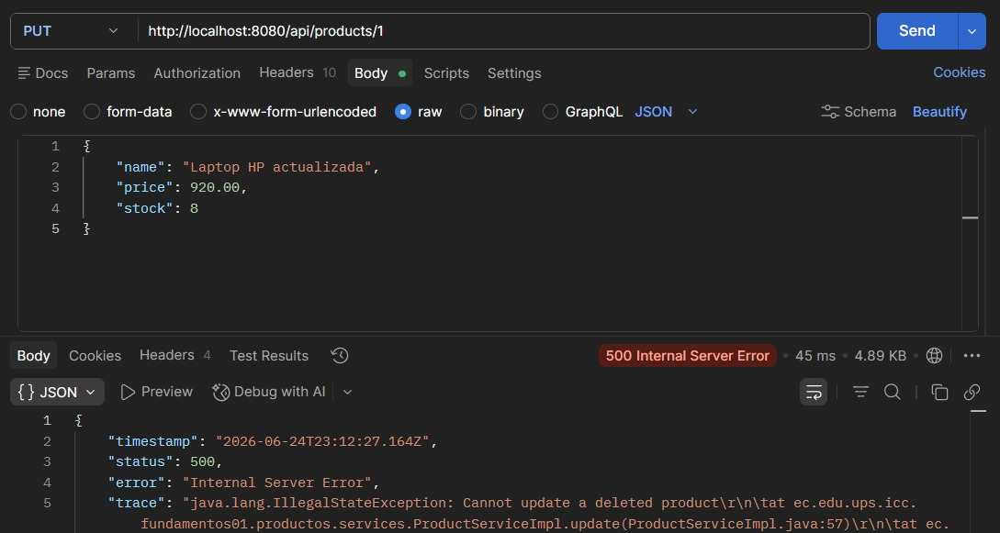
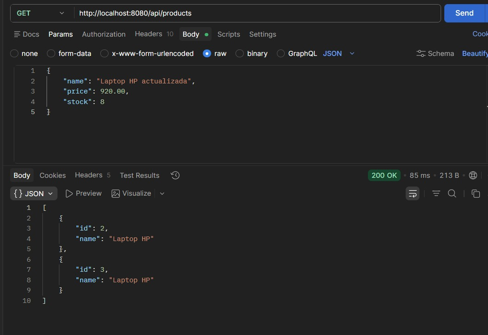

# Proyecto Fundamentos01

## 1. Funcionamiento de Spring Boot

## 2. Endpoint de Status (`/api/status`)

## 3. Endpoints de Estudiantes (`StudentController`)

### Lista de Estudiantes (`/api/students`)

### Conteo de Estudiantes (`/api/students/count`)

## 4. Endpoints de Productos (`ProductController`)

### Validación de datos con `@Valid` (price, stock y name inválidos)

### Reglas de negocio: eliminación lógica (`GET`/`DELETE` sobre producto eliminado)

### Endpoint FindAll no agrega los productos eliminados

## Conclusión
Esta implementación demuestra
la eficiencia de Spring Boot
para estructurar aplicaciones web.
A través de anotaciones simples como `@RestController` y `@GetMapping`, logramos separar la lógica de enrutamiento y exponer múltiples servicios (estado de salud, consulta de datos y métricas simples) de manera clara, modular y lista para integrarse con cualquier cliente frontend.